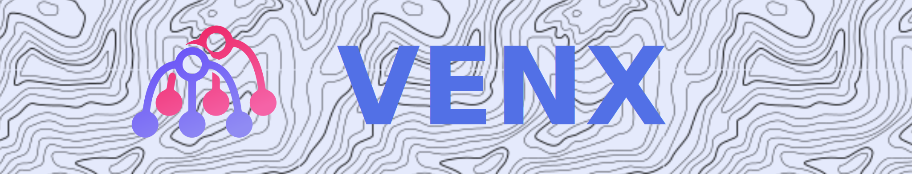

## Introduction
> Project is no more maintaned and developed.  
> And current state of project does not have any working demo.

Venx is an experimental voxel engine written in rust. Aiming to be as fast as possible by utilizing GPU compute power and Sparse Voxel Octrees.

## History and why it exists

I was always frustrated about minecraft's stutters and poor performance. I have tried to find existing voxel engines that could work for me, but all of them were not fast enough. I always wanted to enter the world and the world is just there, loaded, full-size of it. It is possible on high-end hardware though (even in minecraft), but i wanted it to work on low-end devices as well.

This project exists as a proof of concept and/or idea for future voxel engines

### Platform (Plat)
Platform or Plat is a concept of this voxel engine. Basically it is a world map on steroids.
Main idea of this, is to have a cross-game and cross-engine file format, that can run anywhere. This would allow to create a mono registry with Plats created in different games, where users can download any map from any game (which built on top of plats) and use it in their own projects.

## How does it work
Engine is built using, as I am aware, completely new technology (i never seen anybody talking about it and/or using it), which I called FDAG (Forked Directed Acyclic Graph).

FDAG is: `Sparse Voxel Octree, where on each leaf there is a list of DAGs and each entry in this list represents a different voxel type`

On top of that I use 4 layers:
- Base : Generated world
- Scheme : Imported buildings from schematics
- Tmp : Layer which will be deleted on save. It serves to load temporary data in it.
- Canvas : Players can place their voxels

Where each layer is just another FDAG.

This technology allows you to store voxels in a really compact (~ Same world sizes as minecraft's) and scalable way, without sacrificing on performance.

Core crate can be compiled to compute shader and can run on gpu and cpu.

### Benefits
- Can be rendered with path-tracing for high-end computers and raster for low-end.
- No need to (de)compress data when loading world from/to hard drive.
- No need to load chunks and meshes for physics. You can traverse entire world and do queries even if it has no mesh/chunks loaded.
- Nice and idiomatic implementation of Level of Details

## What is done
Engine is done halfway through.
But 90% of features described above are working or were working at some point.

## Technology used
- Bevy : testing and venx integration
- rust-gpu : compiling venx-core to spv
- wgpu-rs : compute shader abstraction

_World with max rendering distance and LoD enabled_:

_GTX1060 x i5-7400 (60FPS)_

## Getting started

`cargo install just`

`just` or `just help`
